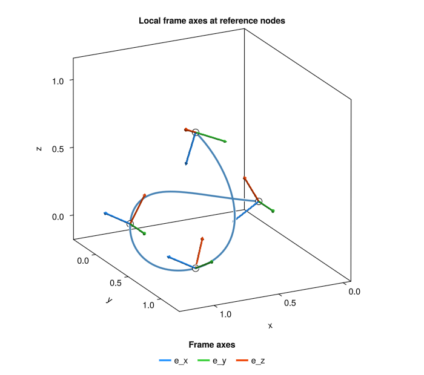
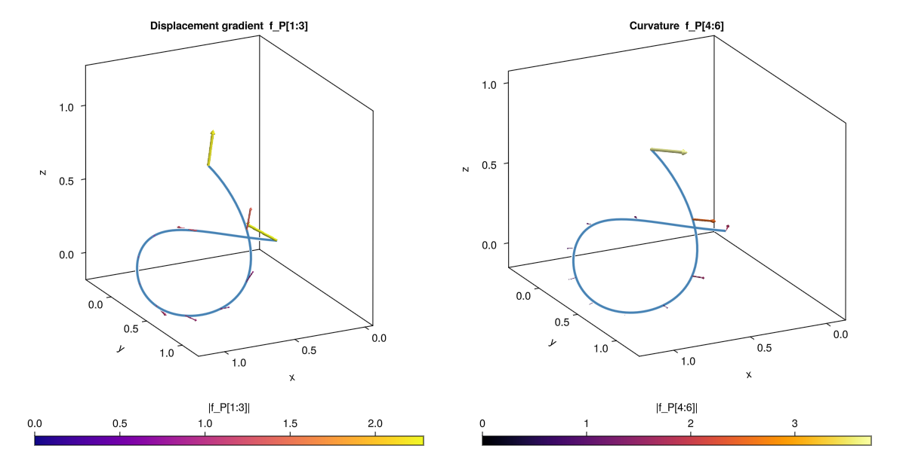
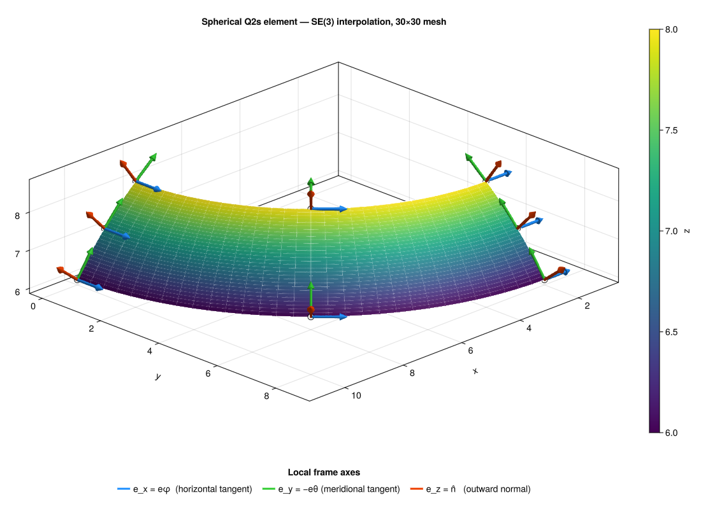

```@meta
CurrentModule = ExpMap
```


# ExpMap.jl

**ExpMap** is a Julia module for the description of **finite motion** of rigid bodies.
It provides the algebraic primitives needed for nonlinear structural mechanics,
robotics, and rigid-body dynamics, all built on lightweight **immutable structs**.

## Design philosophy

Every type (`VEC3`, `MAT3`, `RV3`, `VEC6`, `MAT6`, `NodeFrame`) is **immutable**:
once constructed, its fields never change.  Operations always return new values,
which makes code predictable and avoids aliasing bugs.

## Package layout

```
src/
├── VEC3.jl            immutable 3D vector (ℝ³)
├── RV3.jl             Cartesian Rotation Vector — encodes SO(3) elements
├── MAT3.jl            immutable 3×3 matrix
├── VEC6.jl            immutable 6D vector (twists, wrenches)
├── MAT6.jl            immutable 6×6 matrix (spatial operators)
├── mat6_array.jl      MAT6 collections → dense Float64 block arrays
├── NodeFrame.jl       nodal frame — element of SE(3)
├── R_SO3.jl           exponential map  so(3) → SO(3)
├── invR_SO3.jl        logarithmic map  SO(3) → so(3)
├── euler_to_rv.jl     ZXZ Euler angles → CRV
├── T_SO3.jl           tangent operator T(φ)
├── DT_SO3.jl          Gâteaux derivative of T(φ)·a w.r.t. φ
├── DinvT_SO3.jl        Gâteaux derivative of T⁻¹(φ)·a w.r.t. φ
├── invT_SO3.jl        inverse tangent operator T⁻¹(φ)
├── T_functions.jl     scalar coefficients α(x), β(x) for T(φ)
├── invT_functions.jl  scalar coefficient γ(x) for T⁻¹(φ)
├── rv3_comp_rule.jl   CRV composition  RV3(a, b)
├── tilde.jl           skew-symmetric (hat) map  ṽ
├── outerp.jl          outer (dyadic) product  u ⊗ v
├── exp_SE3.jl         exponential map  se(3) → SE(3)
├── log_SE3.jl         logarithmic map  SE(3) → se(3)
├── sk_SE3.jl          hat map for SE(3)  v → sk(v)
├── Adj_SE3.jl         adjoint representation Ad(H) and ad(a)
├── bracket.jl         anticommutator  ũṽ + ṽũ
├── T_SE3_input.jl     auxiliary inputs for the SE(3) tangent operator
├── T_SE3_data.jl      data structure for the SE(3) tangent operator
├── T_SE3_input_data.jl  complete data for the directional derivative D_p(T_SE3·a)
├── T_SE3.jl             SE(3) tangent operator  T_SE3(p)
├── invT_SE3_input.jl    auxiliary inputs for the inverse SE(3) tangent operator
├── invT_SE3.jl          inverse SE(3) tangent operator  T_SE3(p)⁻¹
├── DT_SE3.jl            Gâteaux derivative of T_SE3(p)·f w.r.t. p
├── DinvT_SE3.jl         Gâteaux derivative of T_SE3(p)⁻¹·f w.r.t. p
├── gauss_points.jl      Gauss–Legendre quadrature points and weights (1D/2D)
├── shape_functions_1D.jl  1D Lagrange shape functions L2, L3, L4 on [−1,+1]
├── shape_functions_2D.jl  2D Lagrange shape functions T3/T6 (triangle), Q1/Q2 (quad)
├── frame_interpol_1D.jl   SE(3) frame interpolation on a 1D element
└── frame_interpol_2D.jl   SE(3) frame interpolation on a 2D surface element
```

## Quick example

```julia
using ExpMap

# Build a nodal frame at position [1,0,0], rotated 90° about z
x   = VEC3(1.0, 0.0, 0.0)
phi = RV3(0.0, 0.0, π/2)
H   = NodeFrame(x, phi)

# Compose two frames (SE(3) group product)
H2  = H * H

# Round-trip: rotation matrix → CRV
R   = R_SO3(phi)          # MAT3
psi = invR_SO3(R)         # RV3 — should equal phi

# Compose two rotation vectors
theta = RV3(phi, RV3(0.0, 0.0, π/4))

# Leibniz identity  d/dφ[T·T⁻¹·a] = 0  (product rule, should be ≈ zero matrix)
psi = RV3(2.0, 1.0, -2.0)
a   = VEC3(3.0, 2.0, 1.0)
T_SO3(psi) * DinvT_SO3(psi, a) + DT_SO3(psi, invT_SO3(psi, a))
```

## Mathematical notation

| Symbol      | Meaning                                           |
|-------------|---------------------------------------------------|
| ψ, φ ∈ ℝ³  | Cartesian Rotation Vector (CRV)                   |
| θ = ‖ψ‖    | Rotation angle (radians)                          |
| k = ψ/θ    | Unit rotation axis                                |
| R ∈ SO(3)  | Rotation matrix (3×3, orthogonal, det = +1)       |
| ψ̃           | Skew-symmetric matrix of ψ (hat map)              |
| u ⊗ v      | Outer (dyadic) product                            |
| T(φ)       | Tangent operator of SO(3)                         |
| T⁻¹(φ)    | Inverse tangent operator                          |
| H ∈ SE(3)  | Rigid-body transformation (position + rotation)   |

## Examples

The `examples/` directory contains two self-contained scripts that exercise
[`frame_interpol_1D`](@ref) and [`frame_interpol_2D`](@ref) on geometrically
non-trivial problems and produce GLMakie visualisations.

### Curve interpolation

**Source files:** `examples/curve_nodes.jl`, `examples/curve_1D_plot.jl`

The example considers a 4-node L4 space curve whose nodal frames are defined by

| Node | Position | Rotation vector ψ |
|------|----------|-------------------|
| H[1] | (0, 0, 0) | (0, π/6, 0) |
| H[2] | (1, 0, 0) | (0, −π/6, 0) |
| H[3] | (1, 1, 0) | (π/6, −π/6, 0) |
| H[4] | (1, 1, 1) | (−π/6, π/3, π/6) |

The element arc length is ℓ = 3 (piecewise chord sum).
`frame_interpol_1D` is evaluated at 101 uniformly-spaced parameter values
ξ ∈ [−1, +1], producing at each point the interpolated [`NodeFrame`](@ref)
and the generalised strain vector **f**\_P (6 components scaled by 2/ℓ):

- **f**\_P[1:3] — translational strain (displacement gradient along the curve)
- **f**\_P[4:6] — rotational strain (curvature and twist)

Figure 1 shows the interpolated curve with the three local frame axes
(e\_x, e\_y, e\_z) drawn as coloured arrows at each of the 4 reference nodes.



Figure 2 shows, on the same curve, the displacement-gradient field `f_P[1:3]`
(left, palette *plasma*) and the curvature field `f_P[4:6]` (right, palette
*inferno*), both sampled at every 10th mesh point and coloured by magnitude.
The maximum values observed are `|f_P[1:3]|` ≈ 2.28 and
`|f_P[4:6]|` ≈ 3.73, reflecting the pronounced rotations (up to ±π/3)
imposed at the reference nodes.



### Shell interpolation

**Source files:** `examples/sphere_Q2s.jl`, `examples/sphere_Q2s_plot.jl`

The example constructs an 8-node serendipity (Q2s) element on the surface of a
sphere of radius R = 10 centred at C = (2, 0, 0).  The patch spans
z ∈ [6, 8] and φ ∈ [0, π/2].  The two latitude circles possess the exact
rational values

```
cos θ₁ = 3/5,  sin θ₁ = 4/5   (lower circle, z = 6)
cos θ₂ = 4/5,  sin θ₂ = 3/5   (upper circle, z = 8)
```

which form a 3-4-5 Pythagorean triplet and satisfy θ₁ + θ₂ = π/2 exactly,
so the mid-latitude angle is θ\_m = π/4.  At each of the 8 nodes the local
frame is constructed with e\_z pointing outward (surface normal n̂), e\_x
along the horizontal tangent e\_φ, and e\_y along the meridional tangent −e\_θ.

`frame_interpol_2D` (Method 1 — reference surface) is then evaluated on a
uniform 30 × 30 parametric grid over [−1, +1]², yielding 961 interpolated
[`NodeFrame`](@ref) objects together with the unit surface normal and the
2 × 2 surface Jacobian at each grid point.

The figure below shows the resulting surface coloured by altitude z, with the
parametric mesh lines and the three local frame axes at each reference node.



**Accuracy of the area integration.**
The spherical area of the patch is

```
A = R² (π/2)(cos θ₂ − cos θ₁) = 100 · (π/2) · (1/5) = 10π ≈ 31.41593
```

A 2 × 2 Gauss quadrature on the interpolated element gives:

| Quantity | Value |
|----------|-------|
| Numerical area (2×2 Gauss) | 31.415808 |
| Analytical area (10π) | 31.415927 |
| Relative error | 3.8 × 10⁻⁶ |

The sub-parts-per-million accuracy is consistent with the second-order
(serendipity) geometry representation of the curved surface.
